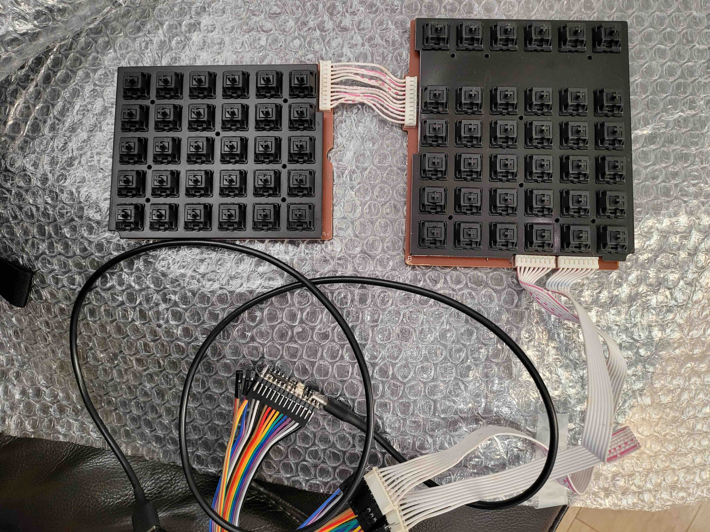
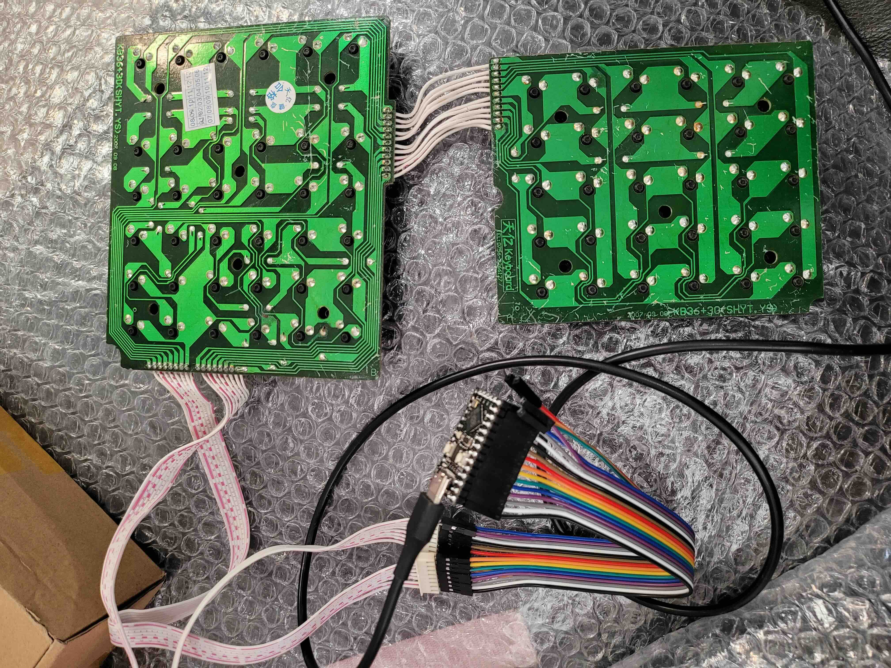

# 囧氏普朗克

囧氏普朗克：拆机黑轴轴板改低成本直列分体键盘

原版为左 5×6 右 6×6 两块轴板，用 11P 排线连接。
右侧电路板引出两组 8P 排线，矩阵见 [图表](../orz_planck_matrix.pdf)。

* Keyboard Maintainer: [居戎氏](https://github.com/lotem)
* Hardware Supported:
  - 收银机黑轴轴板，含 PCB
  - PCB：天亿键盘 KB36+30(SHYT.YS)
  - 主控：RP2040
  
* Hardware Availability: 两种规格的黑轴轴板海鲜市场有售，8.88/9.99 一块

## 线序

左手一侧的 PCB 一角标注为 A，右手一侧 PCB 标注为 B。

A 板拆除原装排线后，从定位板一面观察。
排线座位置自下而上标注了行线 `1 2 3 4 5`、列线 `C D E F G H`。

B 板拆除原装排线后，从定位板一面观察。
排线座位置由左至右标注了两组 8 Pin 排线，分别为
行线 `1 2 3 4 5 6 7 8`、列线 `A B C D E F G H`。

A、B 板对应的行线、列线通过侧方的 11 P 排线连接。

B 板下方的两组 8 P 排线连接主控。

RP2040 主控引脚定义：

 - 1 ~ 8 行 : GP0 ~ GP7
 - A ~ H 列 : GP8 ~ GP15

Make example for this keyboard (after setting up vial-qmk build environment):

    make orz_planck/orz:vial

Flashing example for this keyboard:

    make orz_planck/orz:vial:flash

See the [build environment setup](https://docs.qmk.fm/#/getting_started_build_tools) and the [make instructions](https://docs.qmk.fm/#/getting_started_make_guide) for more information. Brand new to QMK? Start with our [Complete Newbs Guide](https://docs.qmk.fm/#/newbs).

## Bootloader

Enter the bootloader in 3 ways:

* **Bootmagic reset**: Hold down the key at (0,0) in the matrix (usually the top left key or Escape) and plug in the keyboard
* **Physical reset button**: Briefly press the button on the back of the PCB - some may have pads you must short instead
* **Keycode in layout**: Press the key mapped to `QK_BOOT` if it is available
