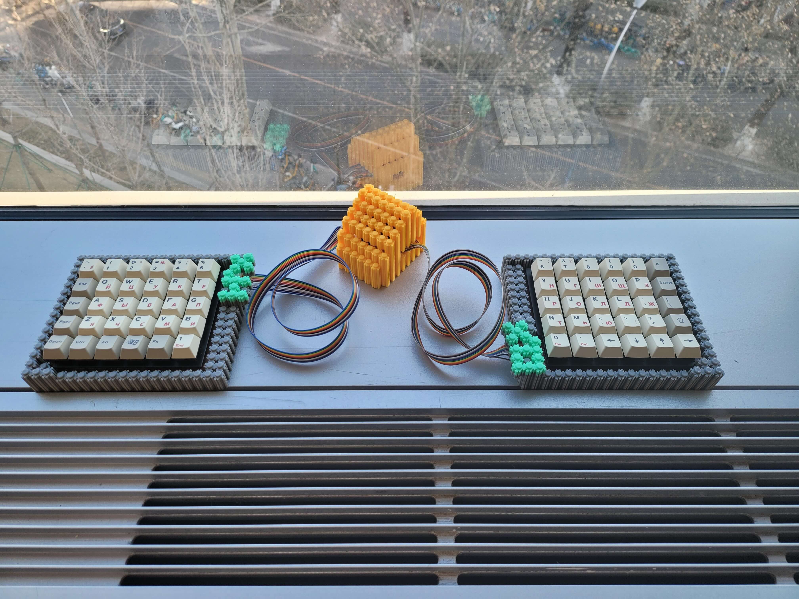
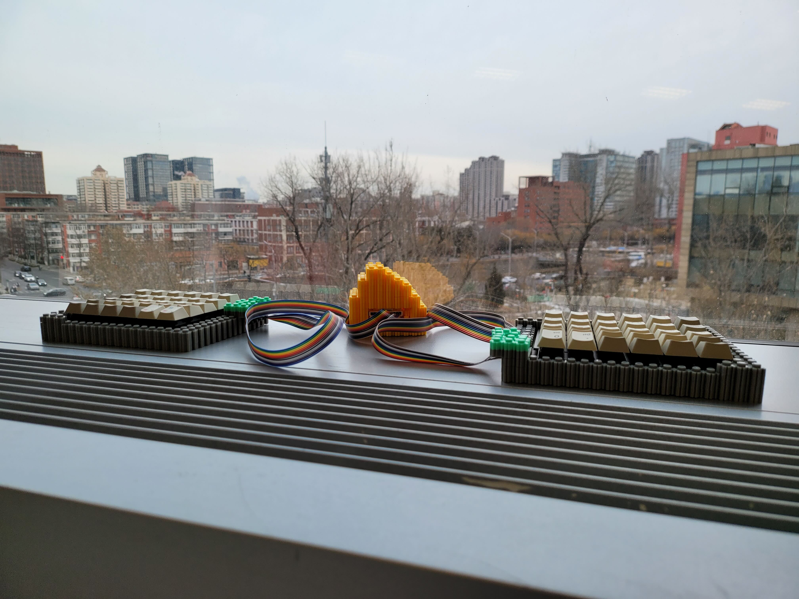

# 囧 60

囧氏普朗克：拆机黑轴轴板改低成本直列分体键盘

原版为左 5×6 右 6×6 两块轴板，用 11P 排线连接。
右侧电路板引出两组 8P 排线，矩阵见 [图表](../orz_planck_matrix.pdf)。

改制为两块 5×6 轴板组分体 Preonic（60%）。

* Keyboard Maintainer: [居戎氏](https://github.com/lotem)
* Hardware Supported:
  - 收银机黑轴轴板，含 PCB
  - PCB：天亿键盘 KB36+30(SHYT.YS)
  - 主控：RP2040
  
* Hardware Availability: 黑轴轴板海鲜市场有售，8.88 一块

## 线序

左手一侧的 PCB 一角标注为 A，右手一侧 PCB 标注为 B。

取 2 块轴板 A。拆除原装排线后，从定位板一面观察。
排线座位置自下而上标注了行线 `1 2 3 4 5`、列线 `C D E F G H`。

## 连接方式

左手键盘正向放置，排线在右侧偏上；
右手键盘旋转 180 度放置，排线在左侧偏下。
两块键盘的行线、列线通过排线分别连接主控板。

现以面包板示例。

行线：

左右手 5 条行线并联。
合并后用右手的线序统一表记。

    左 5 4 3 2 1
    右 1 2 3 4 5
    并 1 2 3 4 5

列线：

左右手共 12 列。主控线序用 C ~ H, I ~ N 表记。

    左 H G F E D C 右 C D E F G H
    主 N M L K J I    C D E F G H

在面包板上如图设置 11 P 排线座。
左右手的排线顺序相反，在行线部分重叠。

    右  . . . . . .[1 2 3 4 5 C D E F G H]
    主  N M L K J I 1 2 3 4 5 C D E F G H
    左 [H G F E D C 5 4 3 2 1]. . . . . .

RP2040 主控引脚定义：

 - 1 ~ 5 行 : GP0 ~ GP4
 - C ~ H 列 : GP5 ~ GP10
 - I ~ N 列 : GP14, GP15, GP26 ~ GP29

## 刷写固件

Make example for this keyboard (after setting up vial-qmk build environment):

    make orz_planck/orz_60:vial

Flashing example for this keyboard:

    make orz_planck/orz_60:vial:flashing

See the [build environment setup](https://docs.qmk.fm/#/getting_started_build_tools) and the [make instructions](https://docs.qmk.fm/#/getting_started_make_guide) for more information. Brand new to QMK? Start with our [Complete Newbs Guide](https://docs.qmk.fm/#/newbs).

## Bootloader

Enter the bootloader in 3 ways:

* **Bootmagic reset**: Hold down the key at (0,0) in the matrix (usually the top left key or Escape) and plug in the keyboard
* **Physical reset button**: Briefly press the button on the back of the PCB - some may have pads you must short instead
* **Keycode in layout**: Press the key mapped to `QK_BOOT` if it is available
