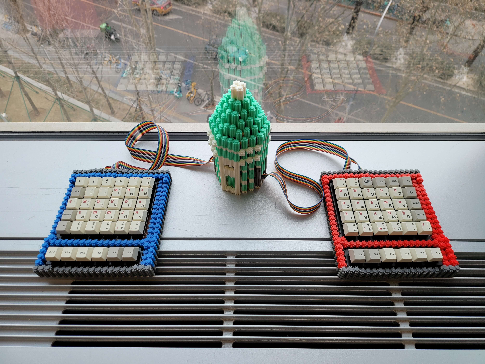
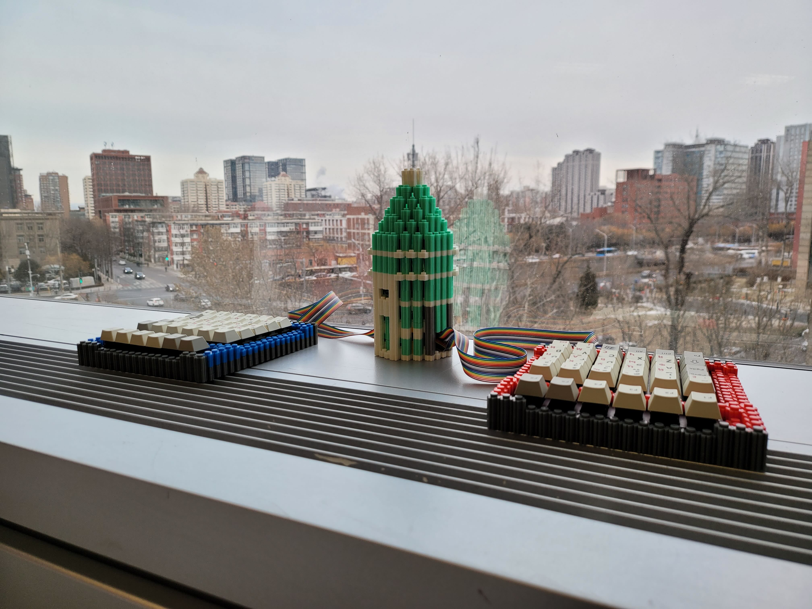

# 囧 75

囧氏普朗克：拆机黑轴轴板改低成本直列分体键盘

原版为左 5×6 右 6×6 两块轴板，用 11P 排线连接。
右侧电路板引出两组 8P 排线，矩阵见 [图表](../orz_planck_matrix.pdf)。

改制为两块 6×6 轴板组包含 F 区的大直列（75%）。

* Keyboard Maintainer: [居戎氏](https://github.com/lotem)
* Hardware Supported:
  - 收银机黑轴轴板，含 PCB
  - PCB：天亿键盘 KB36+30(SHYT.YS)
  - 主控：RP2040
  
* Hardware Availability: 黑轴轴板海鲜市场有售，9.99 一块

## 线序

左手一侧的 PCB 一角标注为 A，右手一侧 PCB 标注为 B。

取 2 块轴板 B。拆除原装排线后，从定位板一面观察。

排线座位置由左至右标注了两组 8 Pin 排线，分别为
行线 `1 2 3 4 5 6 7 8`、列线 `A B C D E F G H`。
 
## 连接方式

左右手键盘皆正向放置，排线在下边偏右。
两块键盘的行线、列线通过排线分别连接主控板。

现以面包板示例。

行线：

左右手 8 条行线并联。
合并后，以右手的线序统一表记。

    左 8 7 6 5 4 3 2 1
    右 1 2 3 4 5 6 7 8
    并 1 2 3 4 5 6 7 8

列线：

左右手部分列线并联，在主控端并作 10 列。
合并后，右手的列线线序与主控线序相同。
左手键盘的 C ~ H 与主控线序顺序相反。
左手键盘的 A、B 在主控线序中记作 J、I。

    右 - - H G F E D C B A
    左 A B C D E F G H - -
    主 J I H G F E D C B A

在面包板上如图设置 4 组 8 P 排线座。
左右手行线重叠，顺序相反；
列线的 C ~ H 部分重叠，顺序相反。

    右 [1 2 3 4 5 6 7 8].[A B C D E F G H]. .
    主  1 2 3 4 5 6 7 8 . A B C D E F G H I J
    左 [8 7 6 5 4 3 2 1]. . .[H G F E D C B A]

RP2040 主控引脚定义：

 - 1 ~ 8 行 : GP0 ~ GP7
 - A ~ H 列 : GP8 ~ GP15
 - I , J 列 : GP26, GP27
 
## 改造电路

由原版矩阵为 8×8，左边的 A 轴板为 5×6 矩阵共 30 键，
可知右边的 B 轴板的 6×6 = 36 颗轴在原版矩阵中仅剩 34 个键位。
实际只用到 33 个矩阵座标，有三组相邻的两个轴的矩阵座标重复，
一组横向的可能是 2u 空格，两组纵向的可能是数字键盘的 2u 加号、回车。

原版的矩阵不是不能用，但需要调整键位。
左手键盘调整为字母从最左一列起，最右一列的 2u 键位设置为 Tab、左 Shift 键。
这不符合常规，破坏了左右对称的布局。

最终听取高手建议，通过切断原版电路加飞线将三个重复的键位改到矩阵中的空位。

  - 右手键盘左起第 1 列的 4B 改为 6B；原版矩阵中仅有这一个空位
  - 右手键盘下起第 3 行的 8H 改为 5H
  - 右手键盘下起第 1 行的 7A 改为 5C
  - 左手键盘同样位置的三个键在新矩阵中改为 3I, 4C, 4H

## 刷写固件

Make example for this keyboard (after setting up vial-qmk build environment):

    make orz_planck/orz_75:vial

Flashing example for this keyboard:

    make orz_planck/orz_75:vial:flash

See the [build environment setup](https://docs.qmk.fm/#/getting_started_build_tools) and the [make instructions](https://docs.qmk.fm/#/getting_started_make_guide) for more information. Brand new to QMK? Start with our [Complete Newbs Guide](https://docs.qmk.fm/#/newbs).

## Bootloader

Enter the bootloader in 3 ways:

* **Bootmagic reset**: Hold down the key at (0,0) in the matrix (usually the top left key or Escape) and plug in the keyboard
* **Physical reset button**: Briefly press the button on the back of the PCB - some may have pads you must short instead
* **Keycode in layout**: Press the key mapped to `QK_BOOT` if it is available
