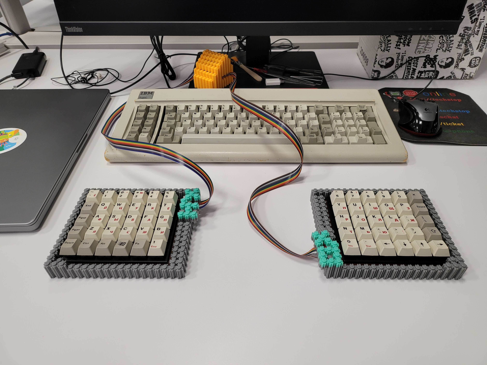
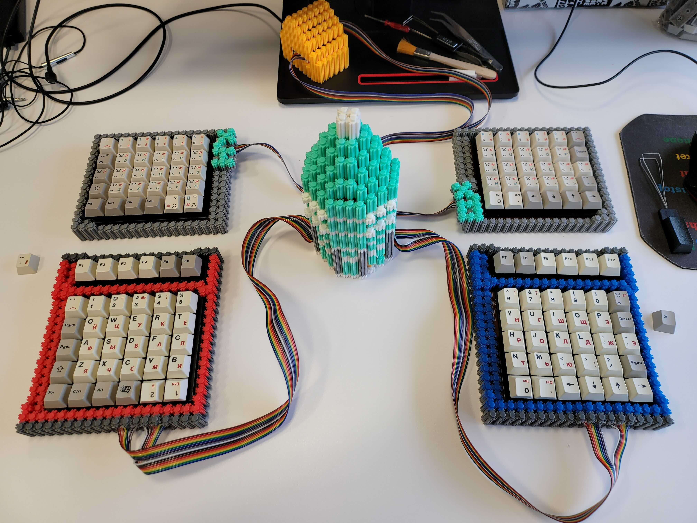

# 囧氏普朗克

囧氏普朗克：拆机黑轴轴板改低成本直列分体键盘

原版为左 5×6 右 6×6 两块轴板，用 11P 排线连接。
右侧电路板引出两组 8P 排线，矩阵见 [图表](orz_planck_matrix.pdf)。

可改制为

  - 复活 [原版](orz/readme.md) 分体键盘；
  - 两块 5×6 轴板组分体 Preonic——[囧 60](orz_60/readme.md)；
  - 两块 6×6 轴板组包含 F 区的大直列——[囧 72](orz_72/readme.md)。

* Keyboard Maintainer: [居戎氏](https://github.com/lotem)
* Hardware Supported:
  - 收银机黑轴轴板，含 PCB
  - PCB：天亿键盘 KB36+30(SHYT.YS)
  - 主控：RP2040
  
* Hardware Availability: 两种规格的黑轴轴板海鲜市场有售，8.88/9.99 一块
